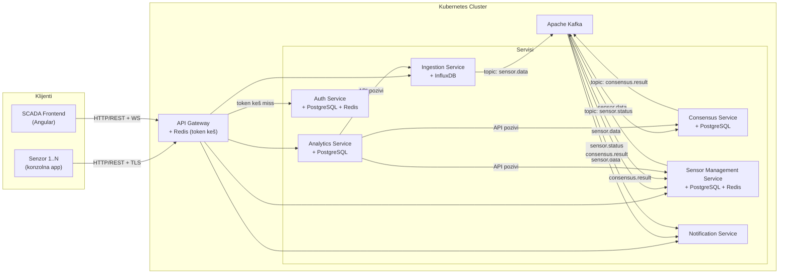
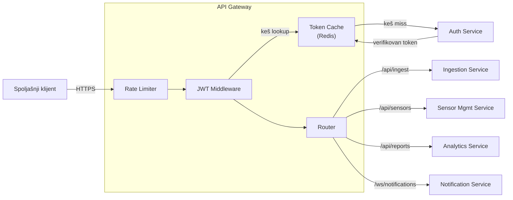
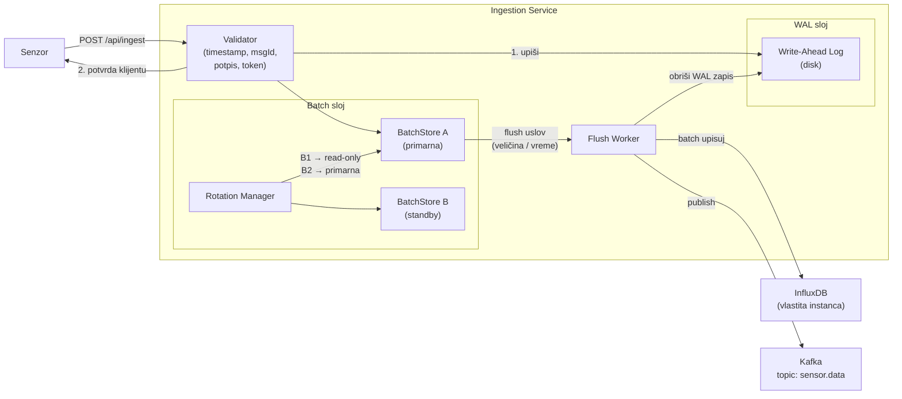
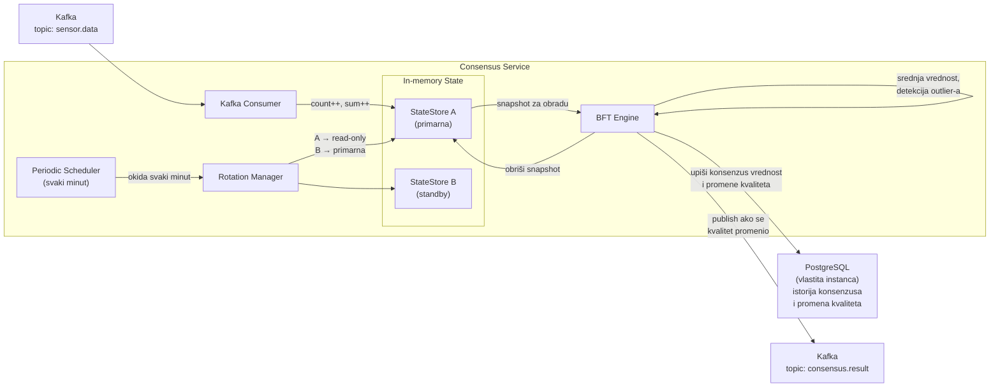
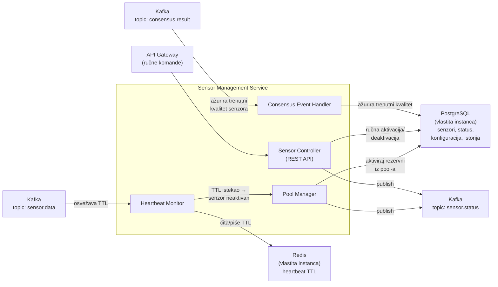
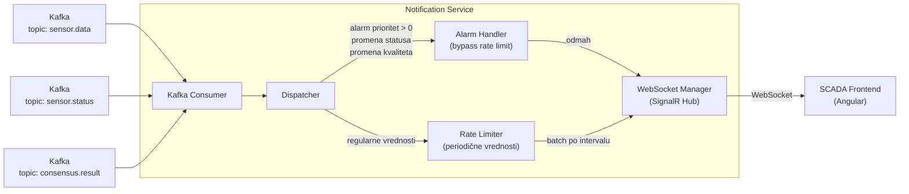
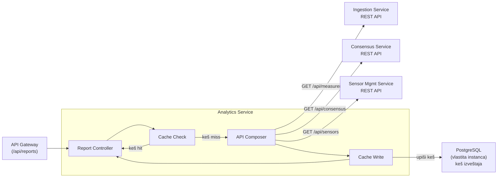
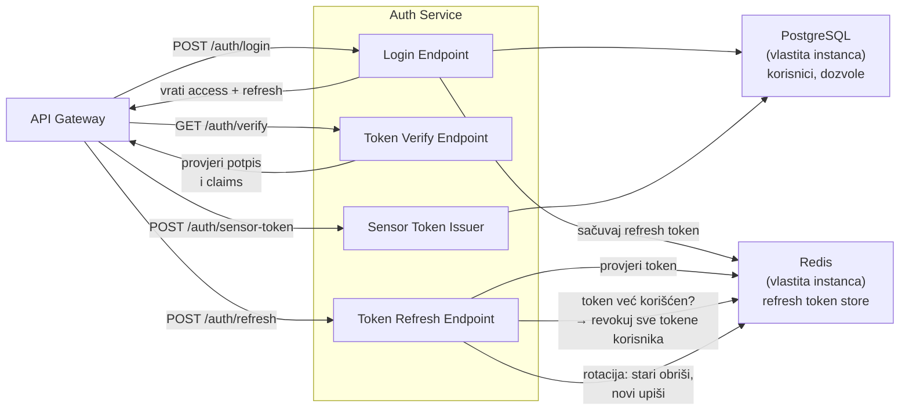
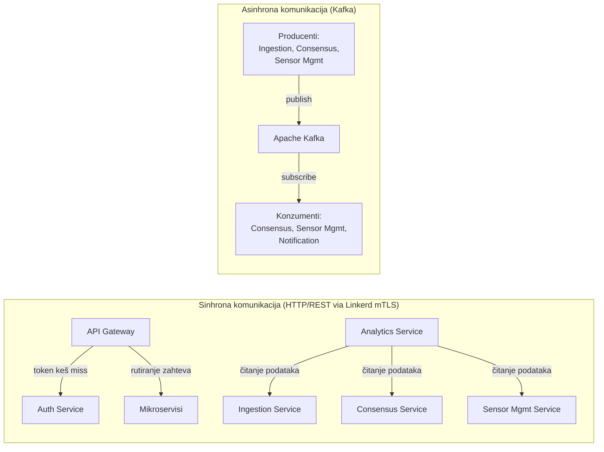

# SNUS Projekat — Dokumentacija

## Sadržaj

1. [Opis projekta](#1-opis-projekta)
2. [Arhitektura sistema](#2-arhitektura-sistema)
   - 2.1 [High-level pregled](#21-high-level-pregled)
   - 2.2 [API Gateway](#22-api-gateway)
   - 2.3 [Ingestion Service](#23-ingestion-service)
   - 2.4 [Consensus Service](#24-consensus-service)
   - 2.5 [Sensor Management Service](#25-sensor-management-service)
   - 2.6 [Notification Service](#26-notification-service)
   - 2.7 [Analytics Service](#27-analytics-service)
   - 2.8 [Auth Service](#28-auth-service)
   - 2.9 [Komunikacija između servisa](#29-komunikacija-između-servisa)
3. [Sigurnost i bezbednost](#3-sigurnost-i-bezbednost)
4. [Deployment i skalabilnost](#4-deployment-i-skalabilnost)
5. [Plan razvoja](#5-plan-razvoja)
6. [Pokretanje sistema](#6-pokretanje-sistema)

---

## 1. Opis projekta

Cilj projekta je razvoj robustnog distribuiranog sistema za prikupljanje, obradu i čuvanje podataka dobijenih od senzorskih čvorova. Sistem je dizajniran kao production-grade rešenje zasnovano na mikroservisnoj arhitekturi.

Sistem obezbeđuje:
- Praćenje trenutnih vrednosti senzora, pristup istorijskim vrednostima i evidentiranje događaja
- Toleranciju na otkaze kroz automatsko upravljanje pool-om senzora
- Konzistentnost podataka primenom BFT (Byzantine Fault Tolerant) konsenzus algoritma
- Pouzdanu i bezbednu komunikaciju između senzora, servera i klijenata

**Primer primene:** Nadzor temperature u kritičnom industrijskom sistemu (npr. jezgro nuklearne elektrane), gde u svakom trenutku tačno pet senzora mora biti aktivno.

### Tehnološki stack

| Komponenta | Tehnologija |
|---|---|
| Backend servisi | ASP.NET Core |
| Senzori (klijenti) | .NET konzolne aplikacije sa TUI |
| Frontend | Angular (SCADA dashboard) |
| Message broker | Apache Kafka |
| Kontejnerizacija | Docker + docker-compose |
| Orkestracija | Kubernetes (Minikube) |
| Service mesh | Linkerd |

### Baze podataka po servisu

Sistem striktno primenjuje **database-per-service** pattern — svaki servis ima isključivu kontrolu nad sopstvenim podacima. Nijedan servis ne pristupa bazi drugog servisa direktno. Razmena podataka između servisa odvija se isključivo kroz Kafka događaje i HTTP/REST API pozive.

| Servis | Baza | Namena |
|---|---|---|
| Ingestion Service | InfluxDB (vlastita instanca) | Vremenske serije merenja senzora |
| Consensus Service | PostgreSQL (vlastita instanca) | Istorija konsenzus rezultata i kvaliteta senzora |
| Sensor Management Service | PostgreSQL (vlastita instanca) + Redis (vlastita instanca) | Status i konfiguracija senzora; heartbeat TTL |
| Auth Service | PostgreSQL (vlastita instanca) + Redis (vlastita instanca) | Korisnici i dozvole; refresh token store |
| Analytics Service | PostgreSQL (vlastita instanca) | Keš izveštaja i analiza |
| API Gateway | Redis (vlastita instanca) | Keš verifikovanih JWT tokena |
| Notification Service | — | Bez perzistencije |

---

## 2. Arhitektura sistema

Arhitektura je zasnovana na mikroservisima, gde svaki servis ima jasno definisanu funkcionalnost i odgovornosti. Service discovery i load balancing delegirani su Kubernetes infrastrukturi. Međuservisna komunikacija i mTLS upravljaju se kroz Linkerd service mesh.

### 2.1 High-level pregled



### 2.2 API Gateway

API Gateway je jedina ulazna tačka sistema za sve spoljašnje zahteve. Implementiran je kao ASP.NET Core servis.

**Odgovornosti:**
- Rutiranje zahteva ka odgovarajućim mikroservisima
- Rate limiting (zaštita od DoS napada)
- Verifikacija JWT tokena uz keširanje
- TLS termination za spoljašnje konekcije

**Service registry i load balancing** nisu odgovornost Gateway-a — delegirani su Kubernetes DNS-u i `Service` resursima. Gateway zna samo logičke nazive servisa (npr. `ingestion-service`), a Kubernetes rešava na koji pod da usmeri zahtev.

**Token verifikacija sa keširanjem:** API Gateway verifikuje JWT tokene u saradnji sa Auth Servisom, ali kako bi se smanjio broj sinhronih poziva, Gateway kešira verifikovane tokene u sopstvenoj Redis instanci. Na svakom zahtevu Gateway proverava lokalni keš — na keš hit, samo validira `exp` claim lokalno bez poziva ka Auth Servisu. Na keš miss, poziva Auth Servis, a rezultat kešira do isteka tokena.



---

### 2.3 Ingestion Service

Odgovoran za prihvatanje merenja od senzora, validaciju, trajno čuvanje i distribuciju podataka ostatku sistema. Jedini servis koji upisuje u vremensku bazu podataka.



**Tok obrade poruke:**

1. Senzor šalje `POST /api/ingest` sa šifrovanom i potpisanom porukom
2. Validator proverava: JWT token senzora, digitalni potpis, timestamp (zaštita od replay-a), jedinstvenost Message ID-a
3. Poruka se upisuje u **WAL** na disku — od ovog trenutka podatak je trajan
4. Klijentu se šalje HTTP 202 Accepted
5. Poruka se upisuje u aktivni **BatchStore** (in-memory)
6. Kada BatchStore dostigne uslov za flush (konfigurabilno: broj poruka ili proteklo vreme), **Rotation Manager** prebacuje aktivni store u read-only i aktivira standby store za nove upise
7. **Flush Worker** upisuje read-only batch u InfluxDB i objavljuje `sensor.data` događaj na Kafka topic
8. Nakon uspešnog upisa, odgovarajući WAL zapisi se brišu

**WAL Recovery:** Pri pokretanju servisa, pre prihvatanja novih zahteva, servis čita sve preostale zapise iz WAL-a i ponovo ih dodaje u BatchStore, čime se garantuje da nijedan potvrđeni podatak neće biti izgubljen.

**Zaštita od replay napada:** Svaka poruka sadrži timestamp i monotono rastući Message ID. Servis odbacuje poruke čiji je timestamp stariji od konfigurabilnog prozora (npr. 30 sekundi) i poruke sa već viđenim Message ID-em za dati senzor. Kratkotrajna evidencija viđenih ID-eva čuva se u in-process memoriji (ne deli se sa drugim servisima).

---

### 2.4 Consensus Service

Worker servis koji implementira pojednostavljeni BFT konsenzus algoritam za procenu kvaliteta senzora. Jedini vlasnik istorije konsenzus rezultata i promena kvaliteta.



**BFT algoritam (pojednostavljen):**

StateStore čuva za svaki senzor: broj primljenih vrednosti i tekuću sumu u posmatranom periodu.

Na svakom okidanju (jednom u minutu):
1. Rotation Manager atomski prebacuje aktivni StateStore u read-only i aktivira standby za nove upise
2. BFT Engine izračunava srednju vrednost i standardnu devijaciju svih senzora sa statusom GOOD
3. Senzori čije vrednosti značajno odstupaju od konsenzusa (npr. van 2σ) označavaju se kao potencijalno maliciozni
4. Pri ponovljenom odstupanju, kvalitet senzora se postavlja na BAD
5. Konsenzus vrednost (prosek GOOD senzora) i sve promene kvaliteta upisuju se u **sopstvenu PostgreSQL instancu** sa odgovarajućim flagovima i timestampom
6. Ukoliko se kvalitet senzora promenio, objavljuje se `consensus.result` događaj na Kafka

Consensus Service je jedini izvor istine za istoriju kvaliteta senzora. Sensor Management Service saznaje o promenama kvaliteta isključivo kroz `consensus.result` Kafka događaj i ažurira svoje stanje na osnovu toga.

---

### 2.5 Sensor Management Service

Odgovoran za upravljanje životnim ciklusom senzora: aktivacija, deaktivacija, heartbeat praćenje i upravljanje pool-om rezervnih senzora. Jedini vlasnik trenutnog stanja i konfiguracije senzora.



**Podela odgovornosti sa Consensus Servisom:**

Consensus Service je vlasnik **istorije** promena kvaliteta (kada, zašto, koja vrednost je uzrokovala promenu). Sensor Management Service je vlasnik **trenutnog stanja** senzora, uključujući tekući kvalitet. Kada Consensus Service detektuje promenu kvaliteta, objavljuje `consensus.result` Kafka događaj — Sensor Management Service konzumira taj događaj i ažurira trenutni kvalitet u sopstvenoj bazi.

**Heartbeat mehanizam:**

Svaki put kada Ingestion Service objavi `sensor.data` Kafka događaj, Sensor Management Service konzumira taj događaj i osvežava Redis TTL ključ za dati senzor (`heartbeat:{sensorId}`, TTL = 10 sekundi). Kada ključ istekne, Pool Manager označava senzor kao neaktivan i aktivira prvi dostupni `STANDBY` senzor iz pool-a.

---

### 2.6 Notification Service

Odgovoran za isporuku obaveštenja SCADA klijentima u realnom vremenu putem WebSocket konekcija. Nema perzistencije — sve se čuva samo u memoriji tokom trajanja konekcije.



**Rate limiting strategija:**

Regularne vrednosti senzora agregiraju se i šalju klijentima u konfigurabilnim intervalima (npr. svake 2 sekunde). Alarmi, promene statusa senzora i promene kvaliteta zaobilaze rate limiter i šalju se odmah.

Pretpostavka je da postoji samo jedna instanca Notification Service-a, pa nema potrebe za distribuiranim backplane-om.

---

### 2.7 Analytics Service

Odgovoran za generisanje izveštaja i analitike. Koristi API Composition pattern — podatke čita isključivo kroz API pozive ka drugim servisima i kešira rezultate u sopstvenoj bazi. Ne konzumira Kafka topice i ne gradi sopstvenu projekciju podataka u realnom vremenu.



Svaki servis izlaže read-only API endpoint-e koje Analytics Service koristi za prikupljanje podataka. Rezultati se kešuju u sopstvenoj PostgreSQL instanci sa konfigurabilnim TTL-om kako bi se smanjio broj ponovljenih poziva.

---

### 2.8 Auth Service

Odgovoran za autentifikaciju korisnika i senzora, izdavanje i verifikaciju JWT tokena. Jedini vlasnik korisničkih podataka i refresh token store-a.



**Token strategija:**
- **Access token:** kratak rok trajanja (npr. 15 minuta), sadrži korisničke role i dozvole, verifikuje se stateless (potpis + expiration)
- **Refresh token:** duži rok trajanja (npr. 7 dana), čuva se u **sopstvenoj Redis instanci** Auth Servisa
- **Rotacija refresh tokena:** pri svakom `/auth/refresh` pozivu, stari token se invalidira i izdaje se novi. Pokušaj korišćenja već iskorišćenog refresh tokena tretira se kao kompromitovana sesija — svi aktivni tokeni tog korisnika se odmah revokuju
- **Sensor tokeni:** posebni JWT tokeni sa ograničenim dozvolama (samo `ingest:write`), konfigurabilnim rokom trajanja, izdaju se administrativno

---

### 2.9 Komunikacija između servisa



| Topic | Producent | Konzumenti | Sadržaj |
|---|---|---|---|
| `sensor.data` | Ingestion Service | Consensus Service, Sensor Mgmt Service, Notification Service | ID senzora, vrednost, timestamp, alarm prioritet |
| `sensor.status` | Sensor Management Service | Notification Service | ID senzora, novi status (ACTIVE/INACTIVE/STANDBY) |
| `consensus.result` | Consensus Service | Sensor Mgmt Service, Notification Service | ID senzora, novi kvalitet (GOOD/BAD/UNCERTAIN) |

**Spoljašnja komunikacija** (senzori i SCADA ↔ sistem) odvija se isključivo kroz API Gateway putem HTTPS/REST i WebSocket-a.

**Inter-servisna komunikacija** prolazi kroz Linkerd service mesh koji transparentno obezbeđuje mTLS između svih podova, bez izmena u aplikacionom kodu.

**Vlasništvo nad podacima:** Nijedan servis ne pristupa bazi drugog servisa. Svaki servis je jedini pisac i čitalac sopstvenih podataka. Koordinacija stanja između servisa odvija se isključivo kroz Kafka događaje i eksplicitne API pozive.

---

## 3. Sigurnost i bezbednost

### 3.1 Service Mesh — Linkerd

Sva inter-servisna komunikacija unutar Kubernetes klastera zaštićena je putem **Linkerd** service mesh-a koji koristi **mutual TLS (mTLS)**. Svaki pod dobija Linkerd sidecar proxy koji:
- Automatski enkriptuje sav saobraćaj između servisa
- Verifikuje identitet oba kraja konekcije (ne samo server, već i klijent)
- Automatski rotira sertifikate (kratki životni vek — 24h)
- Pruža observability bez instrumentacije u kodu

Aplikacioni kod ne upravlja sertifikatima — to je isključivo odgovornost Linkerd kontrolne ravni.

### 3.2 Autentifikacija i autorizacija

- Svi zahtevi ka API Gateway-u moraju sadržati validan JWT Access token (osim `/api/auth` endpoint-a)
- API Gateway verifikuje token uz keširanje u sopstvenoj Redis instanci — sinhroni poziv ka Auth Servisu vrši se samo na keš miss
- Senzori se autentifikuju posebnim sensor JWT tokenima sa minimalnim dozvolama (`ingest:write`)
- Refresh token rotacija sa automatskom revokacijom celokupne sesije pri detekciji ponovne upotrebe

### 3.3 Zaštita od napada

**Replay napadi:** Svaka poruka senzora sadrži timestamp i monotono rastući Message ID. Ingestion Service odbacuje poruke van vremenskog prozora i poruke sa već viđenim ID-em (in-process evidencija).

**DoS napadi:** API Gateway implementira rate limiting po senzor ID-u. Senzor koji pošalje više od 10 poruka u sekundi biva privremeno blokiran.

**Enkripcija poruka:** Sve poruke koje senzori šalju serveru su šifrovane (AES) i digitalno potpisane (RSA/ECDSA), čime se obezbeđuje poverljivost i integritet podataka.

### 3.4 Mrežna bezbednost

Sistem se ne oslanja isključivo na `localhost` adrese — komunikacija se odvija preko konkretnih mrežnih adresa. Bezbednosni rizici ovakvog pristupa su adresovani kroz:
- TLS za sve spoljašnje konekcije (HTTPS)
- mTLS za inter-servisnu komunikaciju (Linkerd)
- Kubernetes Network Policies koje ograničavaju koji podovi mogu međusobno komunicirati

---

## 4. Deployment i skalabilnost

### 4.1 Lokalno okruženje — docker-compose

Za lokalni razvoj i testiranje koristi se `docker-compose` koji podiže sve servise i njihove izolisane baze podataka na jednoj mašini. Svaka baza podataka podiže se kao poseban kontejner, čime se i lokalno poštuje database-per-service izolacija.

```
docker-compose up
```

### 4.2 Produkcijsko okruženje — Kubernetes (Minikube)

Svi servisi su kontejnerizovani koristeći Docker i deployuju se na Kubernetes klaster. Kubernetes preuzima odgovornost za:
- **Service discovery:** DNS-bazirano otkrivanje servisa
- **Load balancing:** distribucija saobraćaja između replika
- **Automatsko skaliranje:** HorizontalPodAutoscaler za servise sa varijabilnim opterećenjem
- **Health checks:** automatski restart podova koji ne odgovaraju na health probe

Linkerd se instalira kao Kubernetes operator i injektuje sidecar proxy u sve podove automatski, putem namespace anotacije.

### 4.3 Baze podataka

Svaki servis ima sopstveni Kubernetes `Deployment` i `PersistentVolumeClaim` za svoju bazu podataka. Baze su fizički i logički izolovane — ne postoji zajednički database server. Sve baze pretpostavljaju se kao replicirane i visoko dostupne u produkcijskom okruženju. Backup strategija i disaster recovery nisu u opsegu ovog projekta.

---

## 5. Plan razvoja

Razvoj je organizovan u faze koje prate logičke zavisnosti između servisa — svaka faza gradi na prethodnoj i rezultira funkcionalnim podskupom sistema.

### Faza 1 — Infrastruktura i autentifikacija

Podizanje bazne infrastrukture bez koje nijedan servis ne može funkcionisati.

- [ ] Podešavanje docker-compose okruženja (Kafka, i izolisane instance: InfluxDB, PostgreSQL x4, Redis x3)
- [ ] Implementacija Auth Service (korisnici, JWT, refresh token rotacija, sensor tokeni; vlastiti PostgreSQL + Redis)
- [ ] Implementacija API Gateway (rutiranje, JWT middleware sa Redis kešom, rate limiting)
- [ ] Verifikacija: login flow, izdavanje tokena, keširani token verify, zaštićeni endpoint

### Faza 2 — Prijem podataka

Osnovna funkcionalnost sistema — senzori mogu slati podatke.

- [ ] Implementacija Ingestion Service (validacija, WAL, BatchStore rotacija, flush u vlastiti InfluxDB)
- [ ] Kafka integracija — `sensor.data` topic
- [ ] Implementacija senzorske konzolne aplikacije sa TUI (generisanje vrednosti, slanje, alarm prikaz)
- [ ] Verifikacija: senzor šalje podatke → podaci stignu u Ingestion InfluxDB

### Faza 3 — Upravljanje senzorima i tolerancija na otkaze

- [ ] Implementacija Sensor Management Service (vlastiti PostgreSQL + Redis)
- [ ] Heartbeat mehanizam (Redis TTL, konzumiranje `sensor.data`)
- [ ] Pool Manager (automatska aktivacija rezervnih senzora)
- [ ] REST API za ručnu kontrolu senzora
- [ ] Verifikacija: senzor prestaje da šalje → sistem automatski aktivira rezervni senzor

### Faza 4 — Konsenzus

- [ ] Implementacija Consensus Service (StateStore rotacija, BFT algoritam, vlastiti PostgreSQL)
- [ ] Detekcija malicioznih senzora, upis istorije promena kvaliteta
- [ ] `consensus.result` Kafka topic → Sensor Management Service ažurira trenutni kvalitet
- [ ] Verifikacija: ubaciti senzor koji šalje pogrešne vrednosti → Consensus ga detektuje → SMS ažurira status

### Faza 5 — Notifikacije i SCADA frontend

- [ ] Implementacija Notification Service (Kafka consumer sva tri topica, rate limiter, WebSocket/SignalR)
- [ ] Osnovna Angular SCADA aplikacija (dashboard sa trenutnim vrednostima, alarm prikaz)
- [ ] Verifikacija: alarm se pojavljuje na dashboardu u realnom vremenu

### Faza 6 — Analitika i finalizacija

- [ ] Implementacija Analytics Service (API composition, vlastiti PostgreSQL keš)
- [ ] SCADA proširenje: istorijski prikaz, grafici, upravljanje senzorima
- [ ] Kubernetes YAML konfiguracije za sve servise i njihove baze
- [ ] Linkerd integracija i verifikacija mTLS
- [ ] Verifikacija: end-to-end demo na dva računara

---

## 6. Pokretanje sistema

### Preduslovi

- Docker i docker-compose
- .NET 8 SDK
- Node.js 20+ i Angular CLI (za SCADA frontend)
- `kubectl` i Minikube (za Kubernetes deployment)
- `linkerd` CLI

### Lokalno pokretanje (docker-compose)

```bash
# Klonirati repozitorijum
git clone <repo-url>
cd snus-projekat

# Pokrenuti infrastrukturu i sve servise (uključujući izolovane baze)
docker-compose up --build

# Pokrenuti senzorsku simulaciju (konzolna app)
cd src/SensorSimulator
dotnet run
```

### Kubernetes deployment (Minikube)

```bash
# Pokrenuti Minikube
minikube start --memory=6144 --cpus=4

# Instalirati Linkerd
linkerd install | kubectl apply -f -
linkerd check

# Omogućiti Linkerd injection za default namespace
kubectl annotate namespace default linkerd.io/inject=enabled

# Primeniti Kubernetes konfiguracije (servisi + njihove baze)
kubectl apply -f k8s/

# Proveriti status
kubectl get pods
linkerd viz dashboard
```

### GitHub repozitorijum

Repozitorijum treba da sadrži:
- `src/` — izvorni kod svih servisa i senzorskog simulatora
- `docker-compose.yml` — lokalno okruženje sa izolisanim bazama
- `k8s/` — Kubernetes YAML konfiguracije
- `docs/` — dokumentacija i slike pokrenutog sistema
- `README.md` — ova dokumentacija
